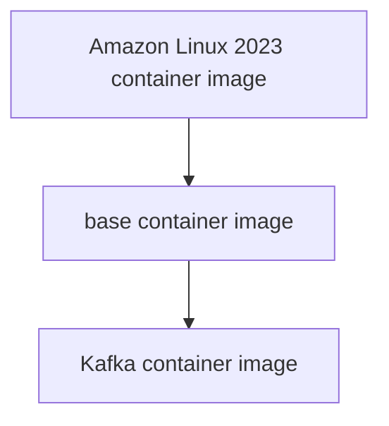

# Development environment

## Prerequisites

- Ensure you installed Docker on your machine. If not, please follow Docker's official documentation.[^1]
- Ensure you cloned our repository.

## Overview

In this setup, we are going to:
1. Write a Dockerfile for building a custom container image for Kafka.
2. Build the base and Kafka container images.
3. Configure Kafka cluster.
4. Run Kafka cluster on three containers.

> [!IMPORTANT] 
>I strongly recommend relying on the Kafka's official documentation and support services [^2]. In this context, I offer a brief overview of the cluster setup with fundamental configurations.

## Write a Dockerfile

I have written two Dockerfiles, one for the base container image and another for the Kafka container image, which already exist in the `docker` directory.

```bash
├── docker
│ ├── dockerfile.base.dev
│ └── dockerfile.kafka.3.6.1
```

For best practices,
- Install all the necessary software, including testing and debugging tools, in the base container image. This approach is applicable only for development (DEV) environments.
- Then Download and install Kafka in the Kafka container image.

## Build the base and Kafka container image

Here, I derive the base container image from the **Amazon Linux 2023** container image. Then, I create the Kafka container image from the previously derived base container image.



**Step 1:** Switch to the `kafka-cluster` directory.

```bash
cd /opt/oss/kafka-cluster
```

**Step 2:** Download Oracle JDK from their official website.

```bash
wget https://download.oracle.com/java/17/latest/jdk-17_linux-x64_bin.tar.gz -P docker/context/common
```

**Step 3:** Download Kafka binaries from their official website.

```bash
wget https://downloads.apache.org/kafka/3.6.1/kafka_2.12-3.6.1.tgz -P docker/context/binary
```

**Step 4:** Build the base container image.

```bash
docker image build -t kafka-base:dev -f docker/dockerfile.base.dev docker/context
```

**Step 5:** Build the Kafka container image.  Suppose if you built separate base image for production and named `kafka-base:prd`, you can use `--build-arg="ENV=prd"` flag to change the `ENV` arguments value in the `dockerfile.kafka.3.6.1`.

```bash
docker image build -t kafka:v3.6.1 -f docker/dockerfile.kafka.3.6.1 docker/context
```

## Configure Kafka cluster

When running the cluster setup, it is crucial to maintain quorum for cluster stability. So, we are going to provision three nodes, each being a Docker container. We have already stored the configuration for each node in the `source/conf` directory.  You can get the configuration template from their official documentation [^3].

```
├── source
│ ├── conf
│ │ ├── broker1.properties
│ │ ├── broker2.properties
│ │ └── controller.properties
```

## Run Kafka cluster

It is considered good practice to store configuration settings in environment variables and inject these variable values from the shell into **Docker Compose** configuration at runtime.

**Step 1:** Store configurations as environment variables in a file.

- Open a new file. 

```bash
vim docker/default.env
```

- Copy and paste the following content, then save the file.

```bash
KAFKA_IMAGE=kafka:v3.6.1
KAFKA_NODE_IP_RANGES=10.1.2.0/24
KAFKA_NODE_1_IP=10.1.2.11
KAFKA_NODE_2_IP=10.1.2.12
KAFKA_NODE_3_IP=10.1.2.13
KAFKA_CLUSTER_ID="UVTnQrsIQFO2pzKQCb1y_g"
KAFKA_HEAP_OPTS="-Xmx256M -Xms256M"
```

**Step 2:** Create and start the containers for the Kafka cluster.

```bash
docker compose -f docker/compose.yml --env-file docker/default.env -p kafka-cluster up -d
```

**Step 3:** Stop and destroy the containers for the Kafka cluster.

```bash
docker compose -f docker/compose.yml --env-file docker/default.env -p kafka-cluster down
```

## Kafka cluster verification procedure.

- Describe runtime state of the cluster using Metadata Quorum tool.

```bash
export NODE=broker1
docker container exec -it kafka-cluster-${NODE}-1 /usr/local/lib/kafka/bin/kafka-metadata-quorum.sh --bootstrap-server  localhost:9092 describe --status
```

Followings are the sample output of the above command that describes the state of the cluster.

```bash
ClusterId:              UVTnQrsIQFO2pzKQCb1y_g
LeaderId:               1
LeaderEpoch:            1
HighWatermark:          829
MaxFollowerLag:         0
MaxFollowerLagTimeMs:   0
CurrentVoters:          [1]
CurrentObservers:       [2,3]
```

- Interactive inspect cluster metadata using Metadata Shell tool.

```bash
export NODE=broker1
docker container exec -it kafka-cluster-${NODE}-1 /usr/local/lib/kafka/bin/kafka-metadata-shell.sh  --snapshot /opt/kafka/data/__cluster_metadata-0/00000000000000000000.log
```

## Cheat sheet for Kafka cluster

- Create topic to store events.

```bash
export NODE=broker1
docker container exec -it kafka-cluster-${NODE}-1 /usr/local/lib/kafka/bin/kafka-topics.sh --create --topic notifiy --bootstrap-server localhost:9092
```

- Describe a specific topic.

```bash
export NODE=broker1
docker container exec -it kafka-cluster-${NODE}-1 /usr/local/lib/kafka/bin/kafka-topics.sh --describe --topic notifiy --bootstrap-server localhost:9092
```

- Delete a specific topic.

```bash
export NODE=broker1
docker container exec -it kafka-cluster-${NODE}-1 /usr/local/lib/kafka/bin/kafka-topics.sh --delete --topic notifiy --bootstrap-server localhost:9092
```

## Additional helpful commands

```bash
export NODE=controller
docker container exec -it kafka-cluster-${NODE}-1 /bin/bash
docker container exec -it kafka-cluster-${NODE}-1 /usr/bin/netstat -ntlp
```

## References

[^1]: [Docker Engine installation](https://docs.docker.com/engine/install)
[^2]: [Kafka documentation](https://kafka.apache.org/documentation/)
[^3]: [Kafka kraft configuration](https://kafka.apache.org/documentation/#kraft_config)
